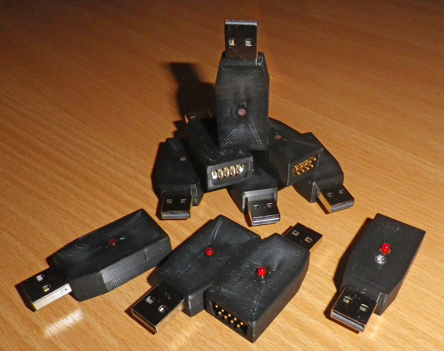
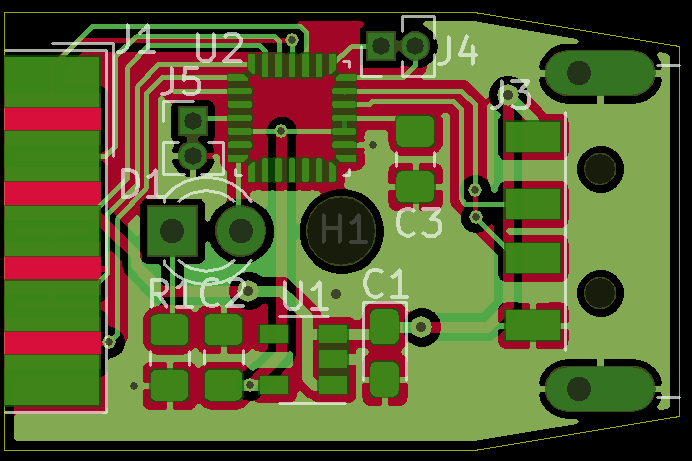
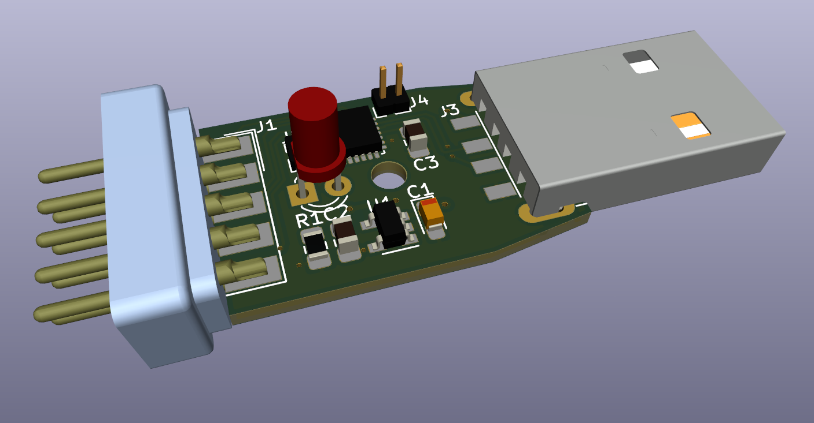
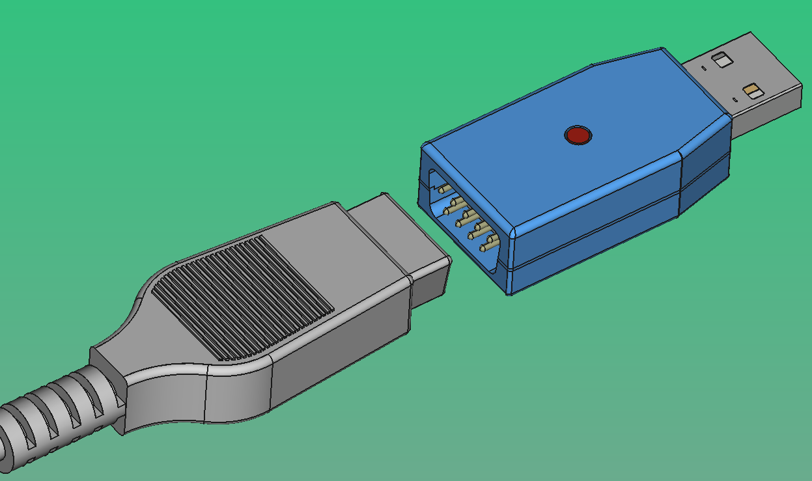
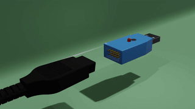

# JoyAdapter

Another 8-bit Atari Joystick to USB adapter.

There are dozens of similar converters available, but I wanted one in a sleek form factor.
It is about the size of the iconic Atari connector itself. 

It is a standard USB-HID class (Joystick) device, generally no drivers required. It has 2 buttons and 2-axis (non configurable). No POT/Paddle inputs only digital (switch to ground) inputs. 

The LED flashes on connect and movement/button action.

## PCB:

schematic: [pdf](Board/schema.pdf)

### Pinout J1 Atari:
Connector  [Wikipedia](https://en.wikipedia.org/wiki/Atari_joystick_port)

| Pin | Function | Pin | Function |
| ------ | ------ | ------ | ------ |
| 1 | Up | 6 | Button 1 |
| 2 | Down | 7 | +5V |
| 3 | Left | 8 | Ground |
| 4 | Right | 9 | Button 2 |
| 5 | N.C. |

**Note:** +5V on pin 7 (not fused or limitied or protected) can damage you USB host if shorted.
5V is not required for most (passive) joysticks i know, so you could pull pin 7 the out of the connector to be safe.

### Parts: 

|Qty|Ref(s)|Value|Manufacturer|Note|Datasheet|
| ------ | ------ | ------ | ------ | ------ | ------ |
|1|C1|4u7F||Tantalum||
|1|C2|1uF||||
|1|C3|100nF||||
|1|D1|L-424IDT|Kingbright|FlatTop|[pdf](https://nl.mouser.com/datasheet/2/216/L-424IDT(Ver.12A)-795377.pdf)|
|1|H1|MountingHole||2.5mm||
|1|J1|DB9 Male||Solder Straight, shell removed||
|1|J3|USB PLUG Type A|Keystone Electronics|SMD|[pdf](https://www.mouser.com/datasheet/2/215/31-744008.pdf)|
|2|J4, J5|Connector 1x2||pitch 1.27mm||
|1|R1|68Ω||||
|1|U1|XC6220B331MR|Torex Semiconductor||[pdf](https://www.torexsemi.com/file/xc6220/XC6220.pdf)|
|1|U2|STM32F042G6Ux|STMicroelectronics|QFN28 4x4mm|[pdf](http://www.st.com/st-web-ui/static/active/en/resource/technical/document/datasheet/DM00105814.pdf)|

Notes: 
- The J1 shell is actually a **DE**-type (common mistake, even KiCad fails this)
- Any low-drop voltage regulator for U1 (SOT23-5 package) either 3V or 3V3, e.q. XC6220B331MR or AP7383-30W5.
- U2 is a STM32F042G6Ux controller, it features crystal-less USB, and 5V tolerant inputs.
- The SWD programming connector was split into two, J4 and J5 due to size restrictions.

### Construction:

Manufacture the PCB with FR4 thickness 1.2mm. (Normal 1.6mm will not fit between the pins of J1).

J1 is a standard DSUB 9pin Male connector. Remove the shell with cutters and pliers and some force.
The remaining inner part can be mounted with the PCB between the pins. 

Solder the LED so the flat top aligns nicely with the top side of the case.

## Case:

Print the Bottom and Top part of the case on your 3D printer (i used a Ultimaker S5).
Use a M2.5 x 8mm Hex Socket Head Cap Screw to join bottom case and top case together.

## Software:

Project setup was done with [STM CubeMX](https://www.st.com/en/development-tools/stm32cubemx.html), further implementation with [VisualGDB](https://visualgdb.com/).
The [Descriptor Tool](https://www.usb.org/document-library/hid-descriptor-tool) was used to design the HID Report.
Its a fairly simple source code, you can adjust it to you favorite development environment.

### Latency:

Updates 100x per second, reason mostly to reduce contact bounce. 
In theory you could send at 1kHz for LowSpeed USB or 8kHz for FullSpeed USB, but you may want to include some debounce logic.
Current implementation thus updates every change in a 10ms interval, faster then most screen refresh rates of retro games. 

## Compatibility
Windows 98/XP/Vista/7/8/10/11, Mac OSX, Linux, RaspberryPI, MiSTer. 

### Tested Devices
The Arcade by S.T.C. Rotterdam

### Design Software

KiCad v6.0.7 + GerberView v2.6.1
FreeCAD v0.19
Ultimaker Cura v4.6.2

Descriptor Tool, Version 2.4
VisualGDB v5.6r8 + STM CubeMX v6.5

### Demo

## Credits
(c) 2019 Enceladus 